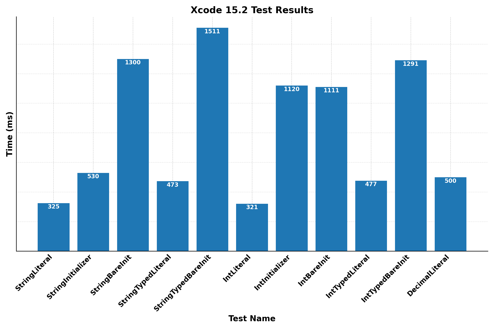
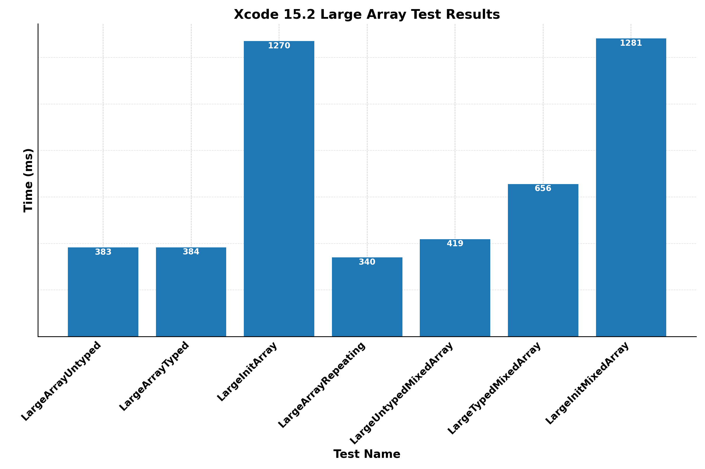
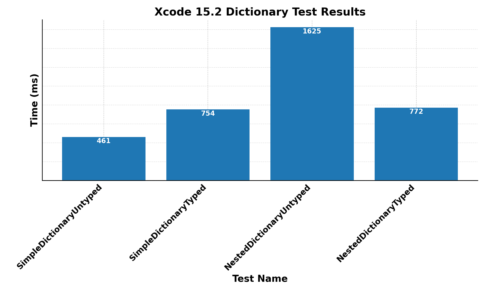
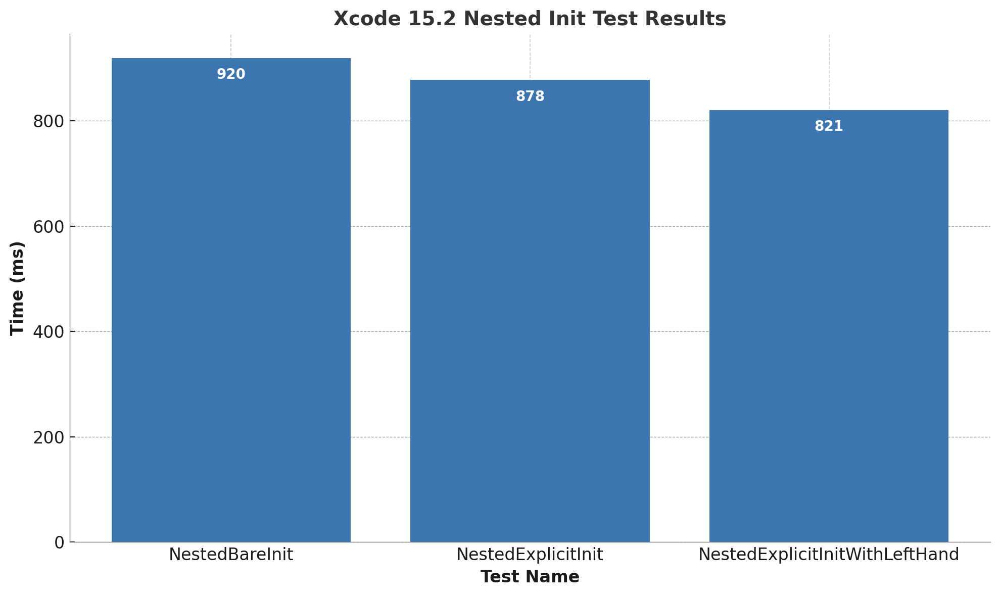
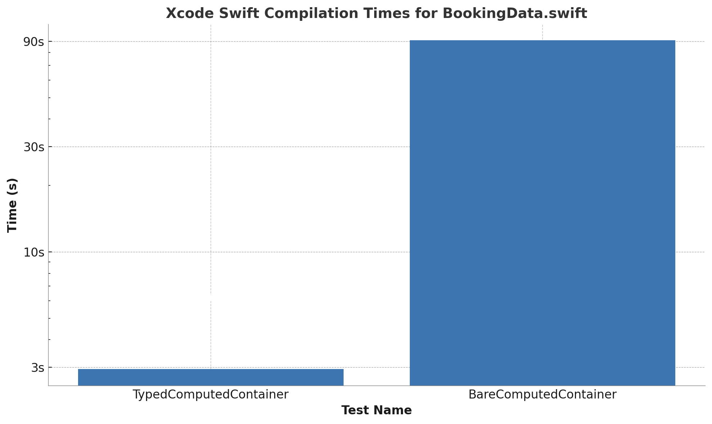

# Swift Type Inference Benchmarks
_Whenever you want to use these benchmarks in original or modified form, you need to mention the original author (me, Lucas van Dongen) and link back to this repository._

A set of benchmarks that compares various aspects of type inference affecting compiler performance. Here are the results when ran on my machine (a 16" 2019 2,3 GHz 8-Core Intel Core i9 MacBook Pro). If you want to run the results for yourself skip towards [the set up section](#how-to-set-up-the-benchmarks)

## Strings and Numbers
 

## Arrays


## Dictionaries


## Constructables


## Computed Container


## How to set up the benchmarks
First set up all of tools necessary to run the benchmarks:

* Install at least one version of [Xcode](https://developer.apple.com/xcode/resources/)
* Install [Hyperfine](https://github.com/sharkdp/hyperfine)
* Install Python 3

## How to run the benchmarks
Run `python3 file_test.py` in the Terminal from the `SwiftBenchmarks` folder.

Warning: `BareComputedContainer` can run very slow on your computer. If want to exluded it just edit `file_test.py` in any text editor and excluded it as follows:

```python
    ...
    'LargeTypedMixedArray': ['LargeTypedMixedArray.swift'],
    'LargeInitMixedArray': ['LargeInitMixedArray.swift'],
    'TypedComputedContainer': ['BookingData.swift', 'TypedComputedContainer.swift'],
   # 'BareComputedContainer': ['BookingData.swift', 'BareComputedContainer.swift']#,
    'FunctionBareInit': ['FunctionData.swift', 'FunctionBareInit.swift'],
    'FunctionTypedInit': ['FunctionData.swift', 'FunctionTypedInit.swift']
}
